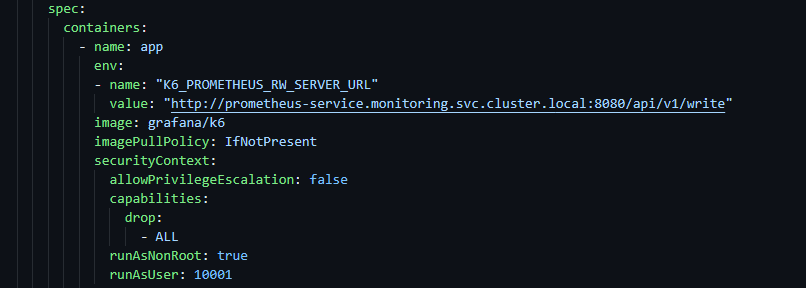

# Run K6 Tests Within A Cluster

## Goal

This lab demonstrates running k6 wihtin a Kubernetes cluster sending metrics to prometheus and visualizing data in grafana

## Getting Started

Switch to `labs/in-cluster` directory

```bash
cd labs/in-cluster
```

### Load Test Files

Let's identify each load test file utilized for this lab.

- `benchmark-k6-cluster.js`, provides a benchmark load test for cluster deployment.

Now let's take a closer look at the load test file utilized for this example, and review its contents with special attention to VU code stage and different type of Checks.

```bash
# Open the file
code scripts/benchmark-k6-cluster.js
```

## Deploying Local Cluster and ngsa-memory

```bash
# NOTE: make sure you still in `labs/in-cluster/` directory
# create cluster, and build/deploy application, the make file used here creates a k3d cluster and deploys ngsa and istio to that cluster
make all

# check if cluster and application is deployed
make check
```

## Verify ngsa-memory is up and running

```bash

kubectl wait pods -n ngsa --all --for condition=ready --timeout=180s

# check ngsa logs
kubectl logs <ngsa-memory pod name> -n ngsa --tail 10
```

## Setup Monitoring

The following instructions deploy Prometheus and Grafana in an existing cluster.

The k6 has an experimental feature name [Prometheus remote write](https://k6.io/docs/results-output/real-time/prometheus-remote-write/), that can be enabled by setting the variable `K6_PROMETHEUS_RW_SERVER_URL`



NOTE: The [k6 deployment file](labs/in-cluster/deploy/k6.yaml) has already set this configuration.

### Install Grafana and Prometheus

```bash

#  deploy prometheus and grafana
kubectl apply -f deploy/monitoring

# Very that prometheus and grafana pods are up an running
kubectl wait pods -n monitoring --all --for condition=ready --timeout=180s

```

### Open grafana dashboard

- Enable port-forward from CLI
   > **Note**
   > Each port forward below needs to be run from its own termina/shell
   > k3d --version

    ```bash
    kubectl port-forward service/prometheus-service 9090:8080 -n monitoring
    ```

    ```bash
    kubectl port-forward service/grafana 3000:3000 -n monitoring
    ```

- Access Grafana from browser at  <http://localhost:3000> - *you can log into your local instance of grafana by using the creds admin/admin*

- Import Official k6 Test Result Dashboard:
    1. Navigate to: <http://localhost:3000/dashboard/import>
    2. In the id field enter the following id: 18030 and click load button
    3. Select Prometheus from the prometheus dropdown and click import button

- Import k6 Load Testing Results  Dashboard:
    1. Navigate to: <http://localhost:3000/dashboard/import>
    2. In the id field enter the following id: 16543 and click load button
    3. Select Prometheus from the prometheus dropdown and click import button

## Deploy k6 from docker image

We are deploying the [k6 docker image](https://hub.docker.com/r/grafana/k6/), however k6 package can be installed on multiple operating systems such as Linux, Mac, and Windows. [k6 Installation options](https://k6.io/docs/get-started/installation/).

Also, we are storing the load test script into a Configmap so it can accessable when k6 scales up.

## How to run a test

The k6 deployment is configured to run 10 VU for 30 minutes

```bash
# create name space
kubectl create namespace k6

# create configmap from load test file - this is used to execute test in kubernetes environment, container loads test script from this configmap
kubectl create configmap k6-config --namespace k6 --from-file=scripts/benchmark-k6-cluster.js

# deploy k6 image to local cluster
kubectl apply -f deploy/k6.yaml

```

## Verify k6 is up and running

```bash

kubectl wait pods -n k6 --all --for condition=ready --timeout=180s

# check k6 logs
kubectl logs <k6 pod name> -n k6 --tail 20
```

## Verify ngsa-memory is receiving requests from k6

Check logs for ngsa-memory pod and locate the "UserAgent" attribute, and verify that looks like this. `UserAgent":"k6/0.44.0 (https://k6.io/)`

```bash

kubectl get pods -n ngsa
# check ngsa logs
kubectl logs <ngsa-memory pod name> -n ngsa --tail 20
```
