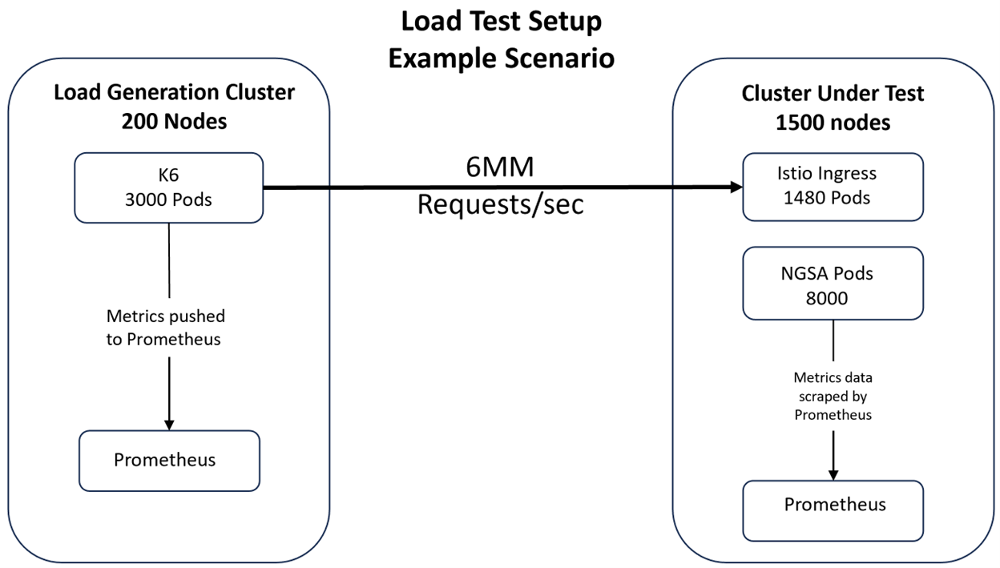

# Implementation

Distributed load testing is a testing strategy utilized to generate high-scale load and run simulations in real-time from multiple load generators distributed across different machines and possibly from different locations.

k6 is a high-performing load testing tool written in Go, test scripts are written in JavaScript. k6 is used for testing the performance and reliability of APIs, microservices, and websites.

k6 targets a worker application "ngsa-memory" that is a lightweight standalone RESTful API, k6 generates load for the test and makes metrics that measure the performance of the system,  metrics are propagated in real-time to Prometheus service by leveraging “Prometheus remote rewrite protocol”, and data is visualized in Grafana  dashboard.

The setup has two AKS clusters.

- Load Generation cluster, with 200 nodes and 3000 k6 pods
- Cluster under test, with 1500 nodes, 1480 istio-ingress pods and 8000 "ngsa-memory" pods

The k6 Pods run the load testing script. After k6 has been deployed it can be scaled up to create multiple Pods, each Pod uses a ConfigMap to access the test script file.
The following example is the base architecture for the distributed load test environment in Microsoft Azure Kubernetes Service that will generate > 6MM requests/second.

## Considerations

1. Scalability: The solution should be designed to handle large clusters with more than 1500 nodes.
2. Resource Management: Proper resource allocation and management should be considered to ensure efficient load testing, including cost and provisioning time for large cluster support.
3. Security: The solution should adhere to security best practices to protect the customer's applications and data.
4. Integration: The solution should be integrated seamlessly with existing Kubernetes infrastructure and tools.

### Learn More

For additional resources, documentation, tutorials, and references on utilizing the proposed solution effectively, please refer to the following links:

1. Documentation
        - [Azure Kubernetes Service](https://azure.microsoft.com/en-us/products/kubernetes-service)
        - [K6](https://k6.io/)
        - [Ngsa-memory app](https://github.com/retaildevcrews/ngsa-app)
        - [Prometheus](https://prometheus.io/)
        - [Grafana](https://grafana.com/)
2. Tutorial
        - [K6 labs](https://github.com/retaildevcrews/k6labs)
3. References
        - [Windows app performance](https://learn.microsoft.com/en-us/windows/apps/performance/)
