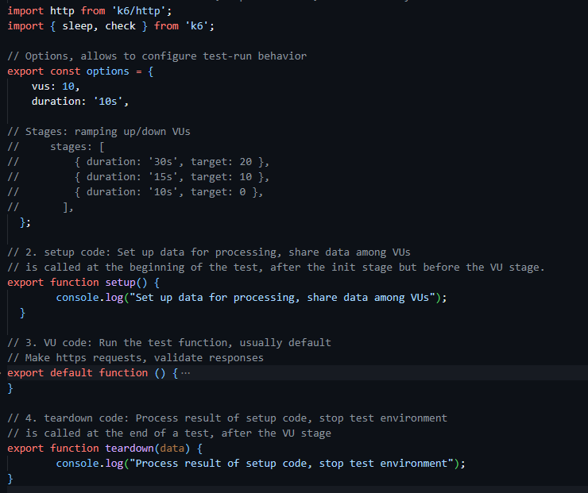
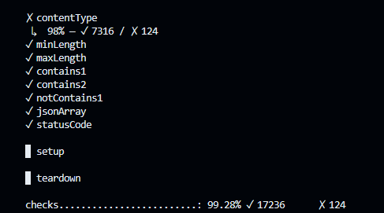
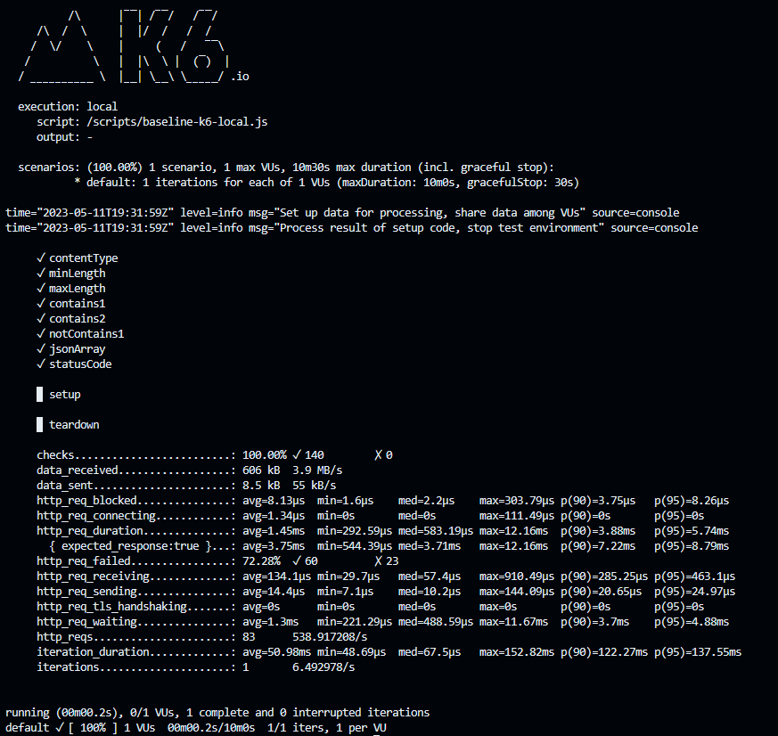

# Run k6 as Docker Container

## Goal

Provide overview of k6 script, and demonstrate running a k6 script as a Docker container instance.

## Background

Let's identify the Test Lifecycle stages for a k6 test file.

- Init
- Setup
- VU code *VU stands for Virtual User*
- Teardown

Load test code snippet



More information related to the topics listed above can be found here.

- [Test Lifecycle Stages](https://k6.io/docs/using-k6/test-lifecycle/)
- [Options](https://k6.io/docs/using-k6/k6-options/)
- [Examples](https://k6.io/docs/examples/)

Typically, VU code is inside the `default` function, VU code runs over and over through the test duration from start to end in sequence. Once the VU reaches the end of the function, it loops back to the start and executes the code all over.

When creating new load test, usually the first step is to define [HTTP requests](https://k6.io/docs/using-k6/http-requests/) to test and validate endpoints. In this case, VU code makes a series of Get HTTP requests, and performs a check to validate the reponse.

For instance we could check for one or more conditions at the time such as:

- HTTP response code
- Text in the response body
- Response body size

Check definitions can be labeled so when the script includes checks, the summary report shows what type of `check` and how many passed or failed



More information about Checks can be found [here](https://k6.io/docs/using-k6/checks/)

## Getting Started

Switch to `/labs/in-dev-container` directory

```bash
cd labs/in-dev-container
```

### Load Test Files

Let's identify each load test file utilized for this lab.

- `baseline-k6.js`, provides a baseline load test.

Now let's take a closer look at the load test file utilized for this example, and review its contents with special attention to VU code stage and different type of Checks.

```bash
# Open the file
code scripts/baseline-k6.js
```

## Run the ngsa container

From codespaces open up two `zsh` terminals

Navigate to terminal `1` to run ngsa-memory

```bash
# Run ngsa-memory
docker run --net=host ghcr.io/retaildevcrews/ngsa-app:beta --in-memory
```

## Run the k6 container

Navigate to the second terminal to run k6 and switch to `labs/in-dev-container` directory.

For example, we are going to run a 5-second, 2-VU load test. In order to do that we are going to approach it in two different ways

- Run the load test script by setting VU and duration values in the file under Options.
- Run the load test script by supplying VU and duration values as arguments, this will ovewrite the values under Option if any.

More information about running k6 can be found [here](https://k6.io/docs/get-started/running-k6/)

```bash
# verify ngsa-memory is accessible from the second terminal, curl should return a 200 http code.
curl -I localhost:8080/version

# Option 1: Run k6 with default options for VUs and duration
docker run --rm -v $(pwd)/scripts:/scripts --net=host grafana/k6 run -e MY_HOSTNAME=localhost:8080 /scripts/baseline-k6.js

# Option 2: Run k6 with arguments. overwrite VUs and duration by setting those arguments in-line
docker run --rm -v $(pwd)/scripts:/scripts --net=host grafana/k6 run --vus 2 --duration 5s -e MY_HOSTNAME=localhost:8080 /scripts/baseline-k6.js
```

## Review Summary Report

As k6 generates load for your test, it also makes metrics that measure the performance of the system. One way to [analyze results](https://k6.io/docs/get-started/results-output/) is by looking at the summary statistics, at the very end of the test summary report.

The report shows an aggregated summary of all [built-in and custom metrics outputs](https://k6.io/docs/using-k6/metrics/) collected and measure when you run a test, including:

- Checks performed
- Data received and sent
- Median and average values
- Minimum and maximum values
- p90, p95, and p99 values

Now let's take a look at an example of an summary report.


